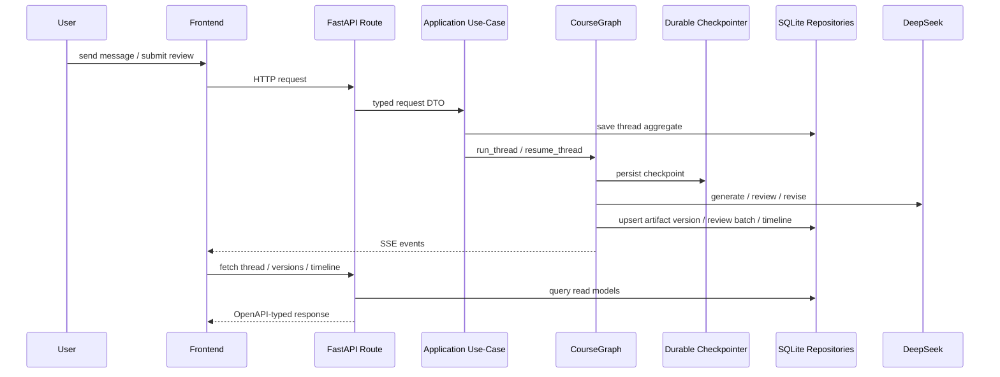

# Refactor Delivery

## Phase Summary

### Phase 1: Architecture and Contract Baseline

改了什么：

- 新增 `docs/architecture/current-state-vs-target-state.md`
- 将 `docs/api/http-api.md` 改为“OpenAPI 为唯一真相”的总览
- 新增 `scripts/export_openapi.py`
- 生成 `docs/api/openapi.json`

为什么改：

- 先消除“README / docs / 代码各说各话”的状态。
- 后续前端严格类型和 client 生成必须建立在真实 OpenAPI 上。

影响模块：

- `docs/*`
- `scripts/export_openapi.py`
- FastAPI OpenAPI 导出链路

如何验证：

- `./.venv/bin/python scripts/export_openapi.py`

### Phase 2: Backend Architecture Convergence

改了什么：

- 引入结构化 runtime state，替代 `run_metadata` 作为主业务承载：
  - `ThreadRuntimeState`
  - `ClarificationRuntimeState`
  - `GenerationSessionState`
  - `HumanReviewRuntimeState`
  - `PauseRuntimeState`
- 拆出清晰仓储边界：
  - `ThreadRepository`
  - `ArtifactVersionRepository`
  - `ReviewBatchRepository`
  - `TimelineEventRepository`
  - `AuditEventRepository`
  - `DecisionRecordRepository`
- `ThreadStore` 改为仓储协调层
- `CourseGraph` 改为 workflow orchestration，并接入 `AsyncSqliteSaver`
- `CourseAgentService` 收缩为 facade，业务下沉到 `app/application/course_agent_use_cases.py`

为什么改：

- 让 thread aggregate、artifact versions、review batches、decision records 不再混在一个无限膨胀字典里。
- 让 interrupt/resume 依赖 durable checkpoint，而不是 `MemorySaver`。
- 让 service 不再和 graph 同时做业务编排。

影响模块：

- `apps/api/app/core/schemas.py`
- `apps/api/app/storage/repositories.py`
- `apps/api/app/storage/thread_store.py`
- `apps/api/app/application/course_agent_use_cases.py`
- `apps/api/app/services/course_agent.py`
- `apps/api/app/workflows/course_graph.py`

如何验证：

- `./.venv/bin/pytest apps/api/tests/test_api.py -q`

### Phase 3: API Contract Governance and Frontend Refactor

改了什么：

- 为真实路由补齐 response models，提升 OpenAPI 质量
- 建立 `FastAPI OpenAPI -> openapi-typescript -> frontend/src/generated/api.d.ts`
- `frontend/src/lib/api.ts` 改为基于生成类型的严格请求层
- `frontend/src/types.ts` 改为从生成 schema 直接派生
- 新增 composables：
  - `useThreadWorkspace`
  - `useThreadStream`
  - `useArtifactViewer`
- 拆分组件：
  - `WorkspaceShell`
  - `ThreadSidebar`
  - `MessageList`
  - `ArtifactPanel`
  - `ReviewPanel`
  - `TimelinePanel`

为什么改：

- 去掉手写 `any` 和手写 schema 漂移。
- 把网络请求、SSE、线程状态、artifact viewer 从 `App.vue` 抽离。
- 把前端结构对齐到 workspace / sidebar / message / artifact / review / timeline。

影响模块：

- `apps/api/app/api/routes/*.py`
- `frontend/package.json`
- `frontend/src/generated/api.d.ts`
- `frontend/src/lib/api.ts`
- `frontend/src/types.ts`
- `frontend/src/composables/*`
- `frontend/src/components/workspace/*`
- `frontend/src/App.vue`

如何验证：

- `cd frontend && npm run generate:api`
- `cd frontend && npm run build`

### Phase 4: Engineering Governance

改了什么：

- 明确 `frontend/` 为当前唯一前端目录
- 新增 `apps/web/README.md`，禁止继续把新前端代码分散到 `apps/web`
- 明确 `apps/api/pyproject.toml` 为 Python 依赖权威入口，`requirements.txt` 为兼容镜像
- 补测试：completion gate、durable resume、auto loop scope

为什么改：

- 防止目录和依赖入口继续漂移。
- 用测试锁住这次重构真正修复的行为。

影响模块：

- `README.md`
- `docs/architecture/project-structure.md`
- `apps/web/README.md`
- `apps/api/pyproject.toml`
- `requirements.txt`
- `apps/api/tests/test_api.py`

如何验证：

- `./.venv/bin/pytest apps/api/tests/test_api.py -q`
- `cd frontend && npm run build`

## Final Directory Structure

```text
apps/
  api/
    app/
      api/routes/
      application/
        course_agent_use_cases.py
        experiments/
      core/
      storage/
        repositories.py
        thread_store.py
      workflows/
        course_graph.py
  web/
    README.md
docs/
  api/
    http-api.md
    openapi.json
  architecture/
    current-state-vs-target-state.md
    project-structure.md
    refactor-delivery.md
frontend/
  package.json
  src/
    App.vue
    generated/api.d.ts
    lib/api.ts
    composables/
      useArtifactViewer.ts
      useThreadStream.ts
      useThreadWorkspace.ts
    components/workspace/
      WorkspaceShell.vue
      ThreadSidebar.vue
      MessageList.vue
      ArtifactPanel.vue
      ReviewPanel.vue
      TimelinePanel.vue
```

## Core Sequence Diagram



## State Machine

### Thread Status

- `collecting_requirements`
  - 等待用户补充需求或确认开始
- `generating`
  - 正在生成主稿
- `review_pending`
  - 已有评审结果，等待人工动作或可直接完成
- `revising`
  - 正在根据人工或自动反馈修订
- `paused`
  - 用户主动暂停当前链路
- `completed`
  - 线程完成
- `failed`
  - workflow 失败

### Completion Gate Rules

- 若最新评审分数 `>= threshold`，线程允许 `completed`
- 即使人工动作全部是 `reject`，只要分数达标，仍然 `completed`
- 只有“产出新版本但尚未重评”时，才会重新进入 `critique_score`
- 没有新版本时，不会因为人工全 reject 再次重复评分

### Auto Optimization Scope

- `auto_optimization_loops` 存在于 `GenerationSessionState`
- 每次新生成链路都会创建新的 generation session
- 因此历史版本或后续手动 regenerate 不会继承上一次 auto loop 次数

## Test Checklist

- `test_thread_lifecycle`
- `test_thread_generation_persists_artifact_and_review_batch`
- `test_low_score_triggers_auto_optimization_loop`
- `test_timeline_versions_and_regenerate_endpoint`
- `test_new_api_endpoints_and_deepagents_experiment`
- `test_pause_and_delete_thread_flow`
- `test_pause_cancels_active_generation`
- `test_mode_switch_and_step_confirmation_persist_artifact`
- `test_completion_gate_all_rejected_but_score_passes`
- `test_interrupt_resume_survives_service_restart`
- `test_auto_optimization_loops_do_not_leak_into_regenerate`
