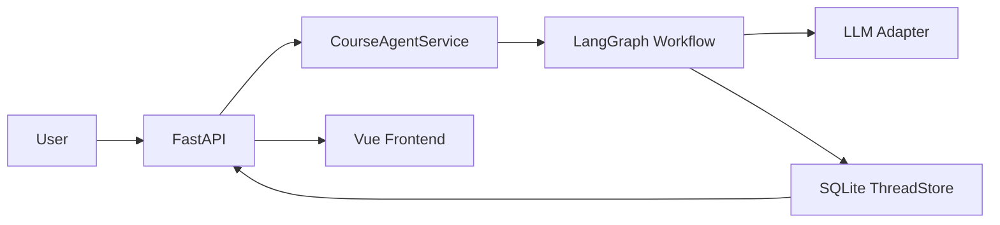
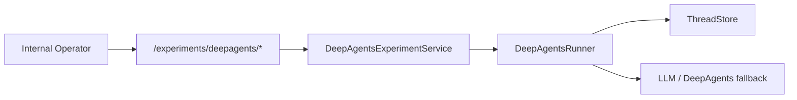

# System Overview

## Summary
- V2 目标是把制课 Agent 从“单进程 demo”提升到“小团队可上线”的状态。
- 主链路仍是对话式制课，但底层改成可持久化、可回放、可版本化、可插拔模型层。

## Runtime Layers
- `domain`
  - 线程、版本、反馈、约束、时间线、生成运行记录。
- `application`
  - 线程用例、再生成用例、实验编排服务。
- `infrastructure`
  - LangGraph orchestration、durable SQLite checkpointer、LLM adapter、SQLite 仓储、DeepAgents runner、审计与事件分发。
- `interfaces`
  - FastAPI HTTP/SSE 接口。

## Main Data Flow

## Experimental Data Flow

## Non-goals
- 本轮不改前端视觉样式。
- 本轮不把 DeepAgents 变成默认产品路径。
- 本轮不做多租户权限系统。
