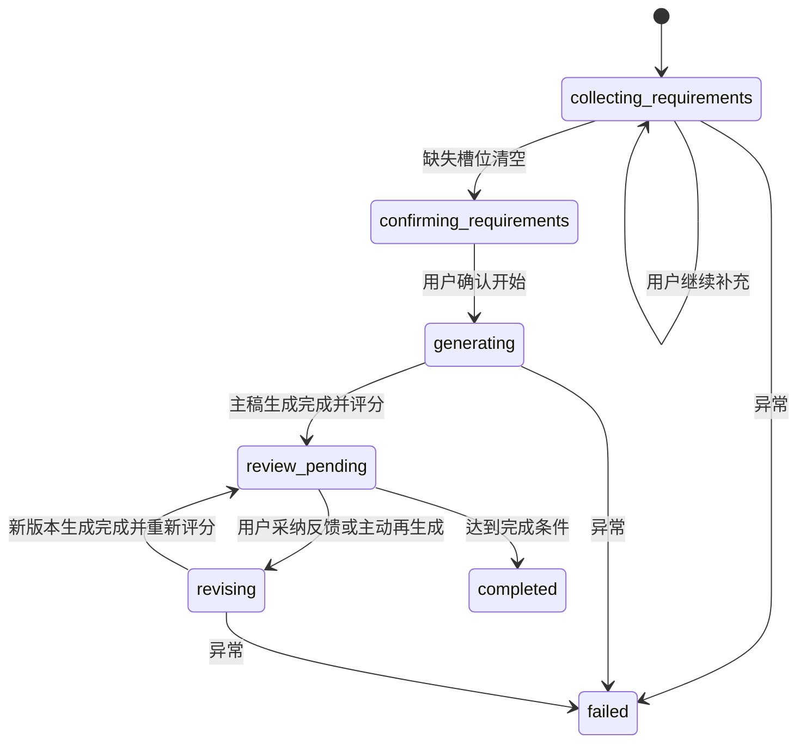

# Conversation State Machine

## Summary
- 对话状态机只解决一件事：把用户从需求模糊带到课程可交付，并且在每一步都有可解释状态。

## Core Rules
- 一次只追问一个缺失槽位。
- 用户明确的负约束在所有后续节点都必须生效。
- 每一次生成和修订都必须生成新版本。
- 评审前后都要写时间线事件，前端不直接读 LangGraph 原始 checkpoint。
